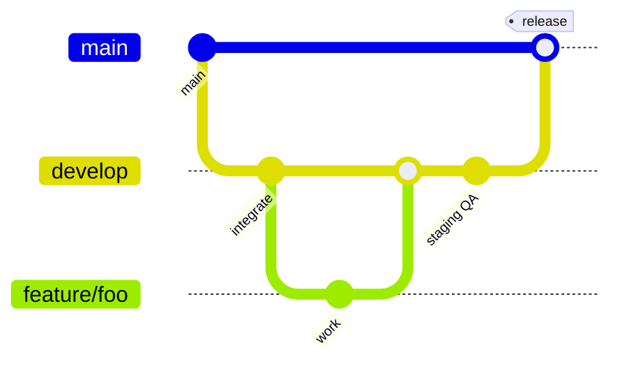

# Branch strategy — Winkly

**Last updated:** 2026-06-04

## Branches

| Branch | Purpose | Deploy / data |
|--------|---------|----------------|
| **`main`** | Production-ready code | Maps to production Supabase + EAS `production` profile |
| **`develop`** | Integration branch for the next release | Maps to staging Supabase + EAS `staging` / `preview` |
| **`feature/*`** | Short-lived work (e.g. `feature/romance-filters`) | Developer machines; PR into `develop` |

## Flow



1. Branch from **`develop`**: `git checkout develop && git pull && git checkout -b feature/my-change`
2. Open a **pull request into `develop`**. CI must pass (`.github/workflows/ci.yml`).
3. After staging QA on `develop`, open a **PR from `develop` → `main`** for release.
4. Hotfixes: branch `hotfix/description` from **`main`**, merge back to **both** `main` and `develop`.

## Pull request rules (recommended GitHub settings)

Configure in **Settings → Branches → Branch protection rules**:

### `main`

- Require pull request before merging (1+ approval)
- Require status checks: **Lint**, **Typecheck**, **Unit tests** (from `.github/workflows/ci.yml`)
- Require branches to be up to date before merge
- Do not allow force-push
- Restrict who can push (maintainers only)

### `develop`

- Require pull request before merging
- Require status checks: **Lint**, **Typecheck**, **Unit tests**
- Allow force-push: **off**

### Creating `develop` (one-time)

If the remote has no `develop` branch yet:

```bash
git checkout main
git pull
git checkout -b develop
git push -u origin develop
```

Then add the protection rules above for `develop`.

## CI triggers

CI runs on:

- Every **pull request**
- Pushes to **`main`** and **`develop`** (see `.github/workflows/ci.yml`)

## Related docs

- [`docs/ENVIRONMENTS.md`](ENVIRONMENTS.md) — dev / staging / prod Supabase and EAS
- [`README.md`](../README.md) — setup and migrations
