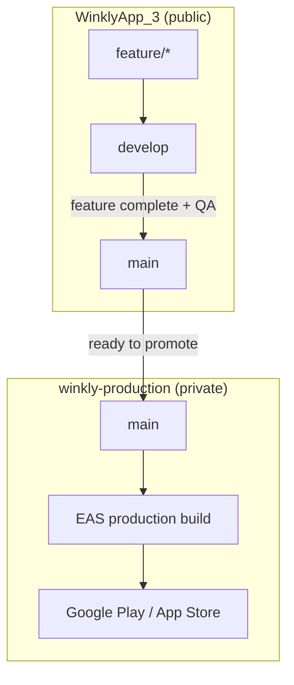
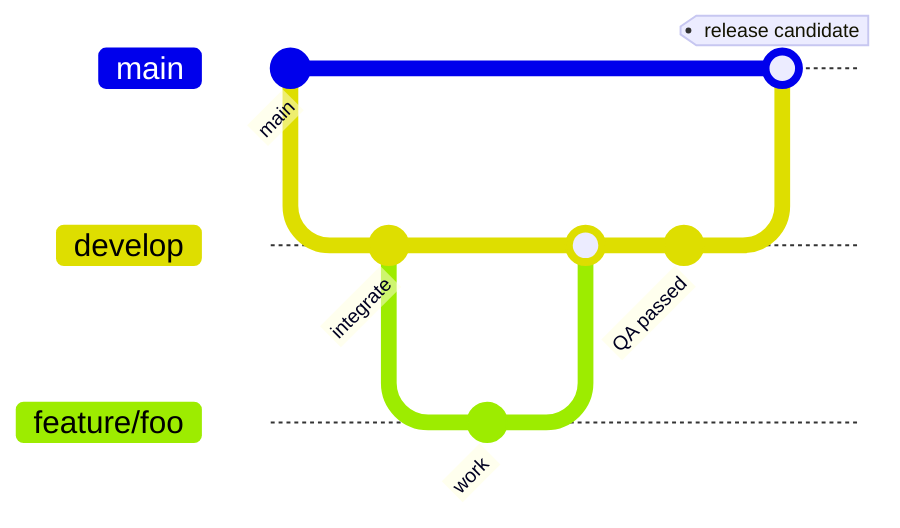

# Branch strategy — Winkly

**Last updated:** 2026-06-06

Winkly uses **two GitHub repositories**. All day-to-day development stays in the public app repo; only battle-tested releases are promoted to the private production snapshot repo.

| Repository | Visibility | Role |
| ---------- | ---------- | ---- |
| [**WinklyApp_3**](https://github.com/mywinkly-cell/WinklyApp_3) | Public | Active development — features, bug fixes, PRs, CI, `docs/`, migrations, Edge Functions |
| [**winkly-production**](https://github.com/mywinkly-cell/winkly-production) | Private | Production snapshot — clean, stable, deployable code only; no WIP or experimental branches |

| Repo | Supabase project | Ref |
| ---- | ---------------- | --- |
| `WinklyApp_3` | WinklyApp (development) | `gwgjdpqskusuejlwrsnd` |
| `winkly-production` | winkly-production | `orjccytcmklzcfjgqwwj` |

**Migrations are authored only in `WinklyApp_3`:** local → dev cloud → promote code → prod cloud. See **supabase/PROJECTS.md**, **docs/ENVIRONMENTS.md**.

---

## End-to-end flow



1. **Develop** in `WinklyApp_3` on `feature/*` → PR into **`develop`**.
2. **Integrate & QA** on `develop` (CI green, smoke test on preview build if needed).
3. **Release candidate** — PR **`develop` → `main`** in `WinklyApp_3` when the batch is ready.
4. **Promote** — merge or cherry-pick from `WinklyApp_3/main` into **`winkly-production/main`** when ready to ship.
5. **Ship** — run **`eas build --profile production`** from a checkout of **`winkly-production/main`** (not from `WinklyApp_3`).

---

## WinklyApp_3 branches

| Branch | Purpose | Supabase / builds |
| ------ | ------- | ----------------- |
| **`develop`** | Integration for the next release | Local + cloud dev (`gwgjdpqskusuejlwrsnd`); optional EAS `preview` |
| **`main`** | Release candidate in the dev repo | Migrations on dev cloud; triggers preview CI build on merge |
| **`feature/*`** | Short-lived work (e.g. `feature/romance-filters`) | Developer machines; PR into `develop` |

### Feature workflow



1. Branch from **`develop`**: `git checkout develop && git pull && git checkout -b feature/my-change`
2. Open a **pull request into `develop`**. CI must pass (`.github/workflows/ci.yml`).
3. After QA on `develop`, open a **PR from `develop` → `main`** in `WinklyApp_3`.
4. **Hotfixes:** branch `hotfix/description` from **`main`**, merge back to **both** `main` and `develop` in `WinklyApp_3`. After verification, promote the hotfix to `winkly-production/main` as well.

---

## winkly-production branches

| Branch | Purpose |
| ------ | ------- |
| **`main`** | Only branch that matters — mirrors shipped (or about-to-ship) production code |

- **No `develop`**, **no `feature/*`**, **no direct pushes** to `main`.
- Changes arrive only via **PR from `WinklyApp_3/main`** (or a documented cherry-pick of specific commits).
- **Store / production EAS builds** always run from this repo’s `main` checkout.

### Branch protection (recommended — set up now)

In **winkly-production** → **Settings → Branches** → rule for **`main`**:

- Require pull request before merging
- Require 1+ approval (maintainers)
- **Do not allow bypassing the above settings**
- Restrict who can push — maintainers only; **no direct pushes**
- Do not allow force-push
- Optional: require signed commits

Source branch for PRs should be **`WinklyApp_3/main`** (same commit SHA after merge) or a short-lived `promote/YYYY-MM-DD` branch cut from that SHA.

---

## Ready to promote (WinklyApp_3/main → winkly-production/main)

Promote only when **all** of the following are true:

| Check | Requirement |
| ----- | ------------- |
| **CI** | Lint, Typecheck, and Unit tests green on `WinklyApp_3/main` |
| **QA** | Smoke test passed on a **preview** build (critical flows: auth, onboarding, mode entry, one chat path) |
| **Migrations** | `supabase db reset` locally → pushed to **dev** `gwgjdpqskusuejlwrsnd` (`npm run supabase:push:development`); dry-run prod (`npm run supabase:push:production:dry-run`) then push **`orjccytcmklzcfjgqwwj`** after promote |
| **Edge Functions** | Deployed to dev cloud first, then production |
| **`supabase/` mirror** | `winkly-production/main` includes full `supabase/` tree from `WinklyApp_3/main` (verify file count matches) |
| **Version** | App version / build number bumped in `apps/mobile` if this release changes store binaries |
| **Secrets** | No new `EXPO_PUBLIC_*` or Supabase secrets missing for production (see **docs/API_KEYS_AND_ENV.md**) |

### Promotion steps

```bash
# 1) Confirm WinklyApp_3/main is the commit you want
cd WinklyApp_3 && git checkout main && git pull

# 2) In winkly-production — open a PR from WinklyApp_3/main (or merge equivalent SHA)
cd ../winkly-production && git checkout main && git pull
# Option A: PR on GitHub from mywinkly-cell/WinklyApp_3 main → mywinkly-cell/winkly-production main
# Option B: local merge of a specific tag/SHA (maintainers only, still prefer PR)

# 3) After winkly-production/main is updated — build from THAT repo only
cd winkly-production/apps/mobile
eas build --profile production --platform android
eas build --profile production --platform ios   # when ready
eas submit --platform all --latest --profile production
```

**Schema workflow (strict):** author migrations only in `WinklyApp_3` → `supabase db reset` → `npm run supabase:push:development` → QA on `gwgjdpqskusuejlwrsnd` → promote `WinklyApp_3/main` to `winkly-production/main` (mirrors `supabase/`) → `npm run supabase:push:production:dry-run` → `npm run supabase:push:production`. Never write migrations directly in `winkly-production`.

---

## Pull request rules — WinklyApp_3

Configure in **WinklyApp_3** → **Settings → Branches**:

### `main`

- Require pull request before merging (1+ approval)
- Require status checks: **Lint**, **Typecheck**, **Unit tests**
- Require branches to be up to date before merge
- Do not allow force-push
- Restrict who can push (maintainers only)

### `develop`

- Require pull request before merging
- Require status checks: **Lint**, **Typecheck**, **Unit tests**
- Allow force-push: **off**

### Creating `develop` (one-time)

If the remote has no `develop` branch yet:

```bash
git checkout main
git pull
git checkout -b develop
git push -u origin develop
```

---

## CI and EAS — which repo runs what

| Action | Repository | Trigger / command |
| ------ | ---------- | ----------------- |
| **CI** (lint, typecheck, test) | `WinklyApp_3` | Every PR; pushes to `main` / `develop` (`.github/workflows/ci.yml`) |
| **Preview build** (TestFlight + Play internal) | `WinklyApp_3` | Push to `main` (`.github/workflows/eas-submit.yml`, profile `preview`) — pre-promotion QA only |
| **Production store build** | **`winkly-production`** | Manual `eas build --profile production` from `winkly-production/main` checkout |

**Never** run `eas build --profile production` from `WinklyApp_3`. Preview/internal profiles may still use the winkly-production Supabase backend via EAS env vars.

---

## Related docs

- [`docs/ENVIRONMENTS.md`](ENVIRONMENTS.md) — dev / production Supabase and EAS
- [`docs/EAS_CI.md`](EAS_CI.md) — EAS profiles, credentials, GitHub Actions
- [`docs/SUPABASE_PRODUCTION.md`](SUPABASE_PRODUCTION.md) — cloud project, migrations, backups
- [`supabase/PROJECTS.md`](../supabase/PROJECTS.md) — project refs and CLI helpers
