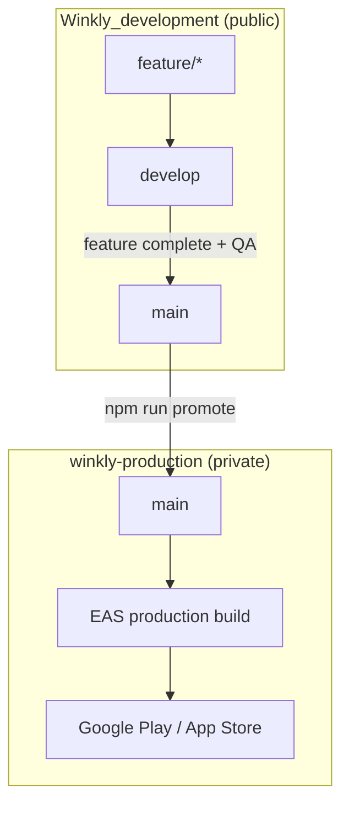
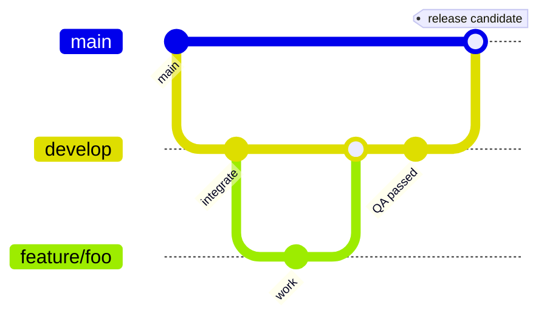

# Branch strategy — Winkly

**Last updated:** 2026-07-28

Winkly uses **two GitHub repositories**. All day-to-day development stays in the public app repo; only battle-tested releases are promoted to the private production snapshot repo.

| Repository | Visibility | Role |
| ---------- | ---------- | ---- |
| [**Winkly_development**](https://github.com/mywinkly-cell/Winkly_development) | Public | Active development — features, bug fixes, PRs, CI, `docs/`, migrations, Edge Functions |
| [**winkly-production**](https://github.com/mywinkly-cell/winkly-production) | Private | Production snapshot — clean, stable, deployable code only; no WIP or experimental branches |

| Repo | Supabase project | Ref |
| ---- | ---------------- | --- |
| `Winkly_development` | Winkly_development | `gwgjdpqskusuejlwrsnd` |
| `winkly-production` | winkly-production | `orjccytcmklzcfjgqwwj` |

**Migrations are authored only in `Winkly_development`:** local → dev cloud → promote code → prod cloud. See **supabase/PROJECTS.md**, **docs/ENVIRONMENTS.md**.

---

## End-to-end flow


```mermaid
flowchart TD
  subgraph dev ["Winkly_development (public)"]
    F[feature/*] --> D[develop]
    D -->|feature complete + QA| M[main]
  end
  subgraph release ["winkly-production (private)"]
    M -->|npm run promote| RP[main]
    RP --> EAS[EAS production build]
    EAS --> Play[Google Play / App Store]
  end
```

1. **Develop** in `Winkly_development` on `feature/*` → PR into **`develop`**.
2. **Integrate & QA** on `develop` (CI green, smoke test on preview build if needed).
3. **Release candidate** — PR **`develop` → `main`** in `Winkly_development` when the batch is ready.
4. **Promote** — from a clean `Winkly_development` checkout on `main`, run **`npm run promote`** (force-pushes an exact mirror to `winkly-production/main`).
5. **Ship** — run **`eas build --profile production`** from a checkout of **`winkly-production/main`** (not from `Winkly_development`).

---

## Winkly_development branches

| Branch | Purpose | Supabase / builds |
| ------ | ------- | ----------------- |
| **`develop`** | Integration for the next release | Local + cloud dev (`gwgjdpqskusuejlwrsnd`); optional EAS `preview` |
| **`main`** | Release candidate in the dev repo | Migrations on dev cloud; triggers preview CI build on merge |
| **`feature/*`** | Short-lived work (e.g. `feature/romance-filters`) | Developer machines; PR into `develop` |

### Feature workflow


```mermaid
gitGraph
  commit id: "main"
  branch develop
  checkout develop
  commit id: "integrate"
  branch feature/foo
  checkout feature/foo
  commit id: "work"
  checkout develop
  merge feature/foo
  commit id: "QA passed"
  checkout main
  merge develop tag: "release candidate"
```

1. Branch from **`develop`**: `git checkout develop && git pull && git checkout -b feature/my-change`
2. Open a **pull request into `develop`**. CI must pass (`.github/workflows/ci.yml`).
3. After QA on `develop`, open a **PR from `develop` → `main`** in `Winkly_development`.
4. **Hotfixes:** branch `hotfix/description` from **`main`**, merge back to **both** `main` and `develop` in `Winkly_development`. After verification, promote again with **`npm run promote`**.

---

## winkly-production branches

| Branch | Purpose |
| ------ | ------- |
| **`main`** | Only branch that matters — exact mirror of the last promoted `Winkly_development/main` |

**Promotion model:** the two repos have **unrelated histories** (production started as a bare README). Promotion is therefore a **force push**: `winkly-production/main` becomes an exact snapshot of your local `Winkly_development/main`. That is intentional — production is a deployable mirror, not a branch you commit to directly.

- **No `develop`**, **no `feature/*`**, **no day-to-day commits** on production.
- Changes arrive only via **`npm run promote`** from `Winkly_development` (see below).
- **Store / production EAS builds** always run from this repo’s `main` checkout.
- Vercel (website) watches **`winkly-production/main`** and redeploys on promote.

### Branch protection (recommended)

In **winkly-production** → **Settings → Branches** → rule for **`main`**:

- Restrict who can push — maintainers only (the people who run `npm run promote`)
- **Allow force-push for those maintainers** (required for the promote script)
- Do not allow everyone else to push or force-push
- Optional: require signed commits

Do **not** require a pull request before merging for this repo — cross-repo PRs do not fit the unrelated-history snapshot model. Gate quality on **`Winkly_development`** CI + the ready-to-promote checklist instead.

---

## Ready to promote (Winkly_development/main → winkly-production/main)

Promote only when **all** of the following are true:

| Check | Requirement |
| ----- | ------------- |
| **CI** | Lint, Typecheck, and Unit tests green on `Winkly_development/main` |
| **QA** | Smoke test passed on a **preview** build (critical flows: auth, onboarding, mode entry, one chat path) |
| **Migrations** | `supabase db reset` locally → pushed to **dev** `gwgjdpqskusuejlwrsnd` (`npm run supabase:push:development`); dry-run prod (`npm run supabase:push:production:dry-run`) then push **`orjccytcmklzcfjgqwwj`** after promote |
| **Edge Functions** | Deployed to dev cloud first, then production after promote (see **docs/RUNBOOK_GO_LIVE.md** §4) |
| **`supabase/` mirror** | After promote, `winkly-production/main` includes the full `supabase/` tree from `Winkly_development/main` |
| **Version** | App version / build number bumped in `apps/mobile` if this release changes store binaries |
| **Secrets** | No new `EXPO_PUBLIC_*` or Supabase secrets missing for production (see **docs/API_KEYS_AND_ENV.md**) |

### Promotion steps

```bash
# 1) Confirm Winkly_development/main is the commit you want
git checkout main && git pull

# 2) Optional preview of what would ship
npm run promote:dry-run

# 3) Force-push exact mirror to winkly-production/main
#    Safety: must be on main, clean tree, in sync with origin, no tracked secrets.
#    Prompts you to type "promote" unless you pass --yes.
npm run promote

# 4) After winkly-production/main is updated — build from THAT repo only
cd ../winkly-production   # or clone fresh
git checkout main && git pull
cd apps/mobile
eas build --profile production --platform android
eas build --profile production --platform ios   # when ready
eas submit --platform all --latest --profile production
```

Script: `scripts/promote-to-production.mjs`. It adds a `production` remote (`git@github.com:mywinkly-cell/winkly-production.git`) if missing, then runs `git push production main --force`.

**Not promoted by this script:** Supabase migrations, Edge Function deploys, dashboard Auth settings, or secrets. Do those separately — **docs/RUNBOOK_GO_LIVE.md** §4.

**Schema workflow (strict):** author migrations only in `Winkly_development` → `supabase db reset` → `npm run supabase:push:development` → QA on `gwgjdpqskusuejlwrsnd` → `npm run promote` (mirrors `supabase/` into the private repo) → `npm run supabase:push:production:dry-run` → `npm run supabase:push:production`. Never write migrations directly in `winkly-production`.

---

## Pull request rules — Winkly_development

Configure in **Winkly_development** → **Settings → Branches**:

### `main`

- Require pull request before merging (1+ approval)
- Require status checks: **Lint**, **Typecheck**, **Unit tests**
- Require branches to be up to date before merge
- Do not allow force-push
- Restrict who can push (maintainers only)

### `develop`

- Require pull request before merging
- Require status checks: **Lint**, **Typecheck**, **Unit tests**
- Allow force-push: **off**

### Creating `develop` (one-time)

If the remote has no `develop` branch yet:

```bash
git checkout main
git pull
git checkout -b develop
git push -u origin develop
```

---

## CI and EAS — which repo runs what

| Action | Repository | Trigger / command |
| ------ | ---------- | ----------------- |
| **CI** (lint, typecheck, test) | `Winkly_development` | Every PR; pushes to `main` / `develop` (`.github/workflows/ci.yml`) |
| **Preview build** (TestFlight + Play internal) | `Winkly_development` | Push to `main` (`.github/workflows/eas-submit.yml`, profile `preview`) — pre-promotion QA only |
| **Code promote** | `Winkly_development` → `winkly-production` | Manual `npm run promote` from clean `main` |
| **Production store build** | **`winkly-production`** | Manual `eas build --profile production` from `winkly-production/main` checkout |

**Never** run `eas build --profile production` from `Winkly_development`. Preview/internal profiles may still use the winkly-production Supabase backend via EAS env vars.

---

## Related docs

- [`docs/ENVIRONMENTS.md`](ENVIRONMENTS.md) — dev / production Supabase and EAS
- [`docs/EAS_CI.md`](EAS_CI.md) — EAS profiles, credentials, GitHub Actions
- [`docs/SUPABASE_PRODUCTION.md`](SUPABASE_PRODUCTION.md) — cloud project, migrations, backups
- [`docs/RUNBOOK_GO_LIVE.md`](RUNBOOK_GO_LIVE.md) — post-promote migrations, functions, secrets
- [`supabase/PROJECTS.md`](../supabase/PROJECTS.md) — project refs and CLI helpers
